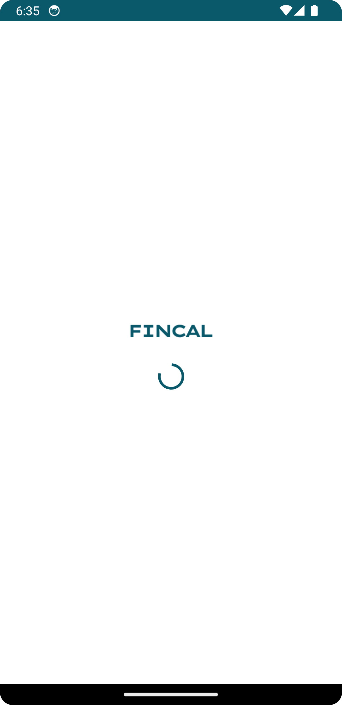
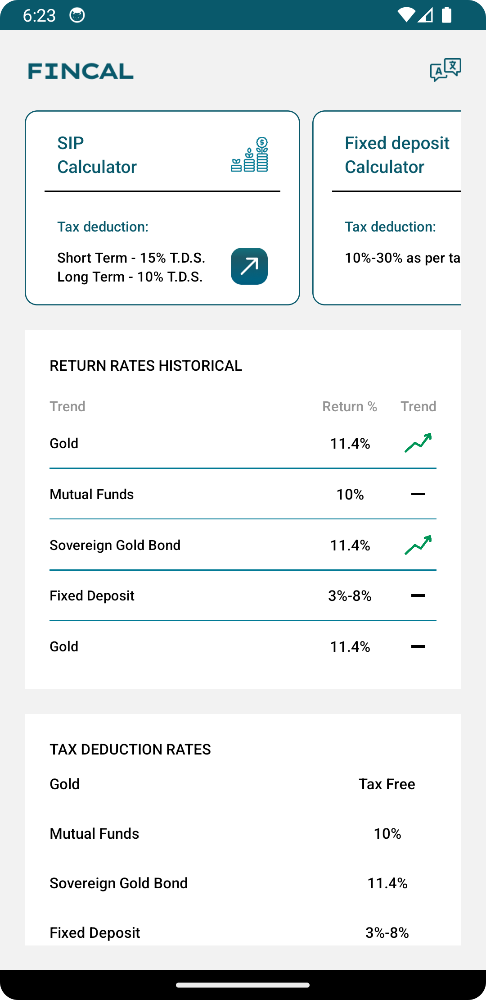
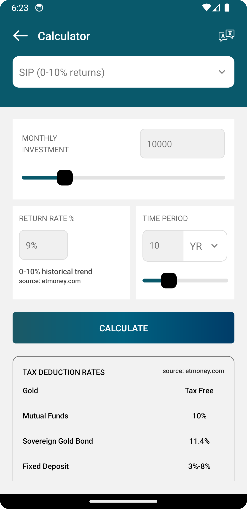
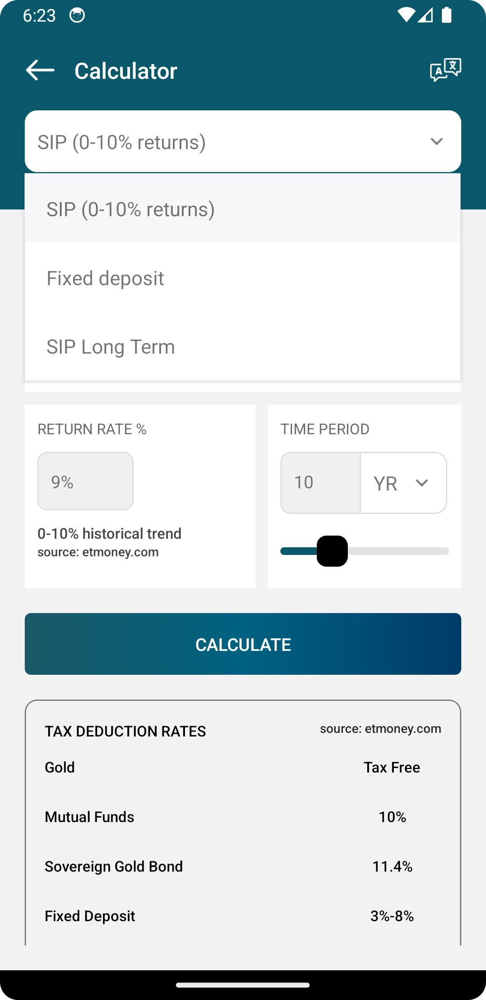
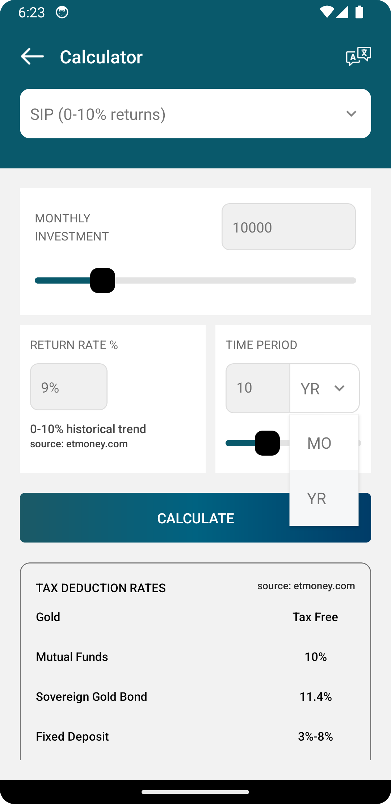
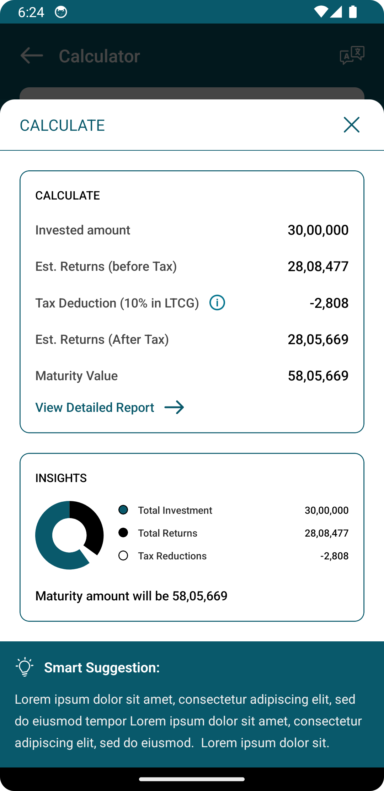
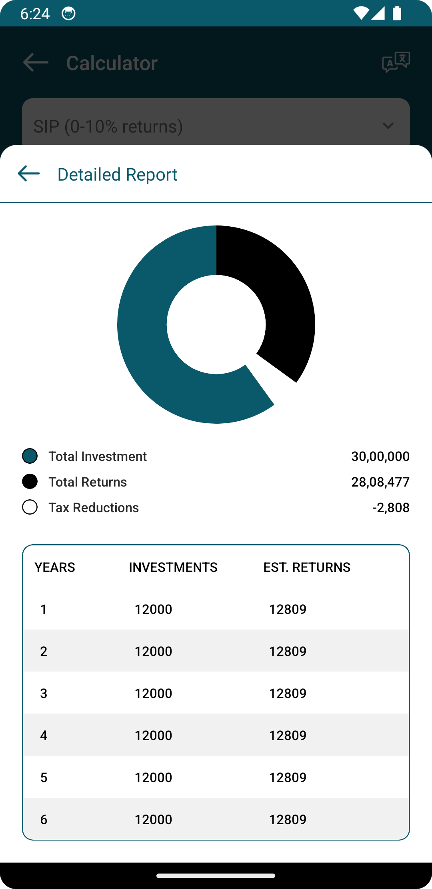

# Calculator App
<h3>IOS App</h3>
<div align="center">
    
    
    
    
    
    
    
</div>

https://github.com/user-attachments/assets/218628fe-f22e-461b-99b1-e9cd0020b696

<h3>Android App</h3>
<div align="center">
    
    
    
    
    
    
    
</div>

https://github.com/user-attachments/assets/27156be3-f0f2-495c-b46a-5a46b12cfac9

<hr />
<h3>Installation and Usage</h3>
<hr />

Download or clone this repo by using the below link:

```
git clone https://github.com/SagarMandani/Calculator.git
```

Go to project root folder

```
cd Calculator
```

```
npm or yarn install
```

## Step 1: Start the Metro Server

First, you will need to start **Metro**, the JavaScript _bundler_ that ships _with_ React Native.

To start Metro, run the following command from the _root_ of your React Native project:

```bash
# using npm
npm start

# OR using Yarn
yarn start
```

## Step 2: Start your Application

Let Metro Bundler run in its _own_ terminal. Open a _new_ terminal from the _root_ of your React Native project. Run the following command to start your _Android_ or _iOS_ app:

Make sure you have an ios Simulator or Android Emulator running or have an ios device with you:

### For Android

yarn android to run the Android application (remember to start a simulator or connect an Android phone)

```
npx react-native run-android
```

### For IOS

```
cd ios && pod install && cd ..
```

yarn ios to run the iOS application (remember to start a simulator or connect an iPhone phone)

```
npx react-native run-ios
```

If everything is set up _correctly_, you should see your new app running in your _Android Emulator_ or _iOS Simulator_ shortly provided you have set up your emulator/simulator correctly.

This is one way to run your app — you can also run it directly from within Android Studio and Xcode respectively.

## Step 3: Modifying your App

Now that you have successfully run the app, let's modify it.

1. Open `App.js` in your text editor of choice and edit some lines.
2. For **Android**: Press the <kbd>R</kbd> key twice or select **"Reload"** from the **Developer Menu** (<kbd>Ctrl</kbd> + <kbd>M</kbd> (on Window and Linux) or <kbd>Cmd ⌘</kbd> + <kbd>M</kbd> (on macOS)) to see your changes!

   For **iOS**: Hit <kbd>Cmd ⌘</kbd> + <kbd>R</kbd> in your iOS Simulator to reload the app and see your changes!

## Congratulations! :tada:

You've successfully run and modified your React Native App. :partying_face:

### Now what?

- If you want to add this new React Native code to an existing application, check out the [Integration guide](https://reactnative.dev/docs/integration-with-existing-apps).
- If you're curious to learn more about React Native, check out the [Introduction to React Native](https://reactnative.dev/docs/getting-started).

# Troubleshooting

If you can't get this to work, see the [Troubleshooting](https://reactnative.dev/docs/troubleshooting) page.

# Learn More

To learn more about React Native, take a look at the following resources:

- [React Native Website](https://reactnative.dev) - learn more about React Native.
- [Getting Started](https://reactnative.dev/docs/environment-setup) - an **overview** of React Native and how setup your environment.
- [Learn the Basics](https://reactnative.dev/docs/getting-started) - a **guided tour** of the React Native **basics**.
- [Blog](https://reactnative.dev/blog) - read the latest official React Native **Blog** posts.
- [`@facebook/react-native`](https://github.com/facebook/react-native) - the Open Source; GitHub **repository** for React Native.
